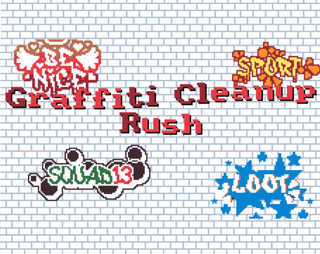

# 🎨 Graffiti Cleanup Rush

A fast-paced arcade game where you battle against overflowing graffiti! Made solo by **Léo Imbert** during **Mini Jam #43**, using **Pyxel**, a retro-style Python game engine.

## 📸 Preview

## 💡 Concept

- **Theme** : Overflow → The wall is being overwhelmed by graffiti.
- **Special Object** : Brush → Your mouse becomes a paintbrush !
Your job ? Clean up graffiti before it overflows the wall, using limited paint and quick reflexes !

## ▶️ How to play

You can play Graffiti Cleanup Rush on [itch.io](https://leo-imbert.itch.io/graffiti-cleanup-rush).

## 🔄 Key Features
- Objective : Prevent more than 10 graffiti from being on the wall at once.
- Mechanics :
    - Left click to paint over graffiti.
    - Refill your paint by hovering over the paint bucket on the right (tiny hitbox !).
    - Collect falling stars (power-ups) for bonuses :
        - Clear all graffiti 🎉
        - Fully refill paint 🪣
        - +50 points 💯
- Game Over : More than 10 graffiti on screen = You lose.
- Challenge : Aim for the highest score before the wall overflows!

## 🕹️ Controls

| Action            | Keys                   |
|-------------------|------------------------|
| Paint graffiti    | Left click on graffiti |
| Refill paint      | Left Mouse Button      |
| Collect power-ups | Click falling stars    |

## 🛠️ Built With

- [Pyxel](https://github.com/kitao/pyxel) – Retro game engine in Python.
- Python 3.10+

## 📄 License

This project is licensed under the MIT License. See [LICENSE](/LICENSE) for more information.